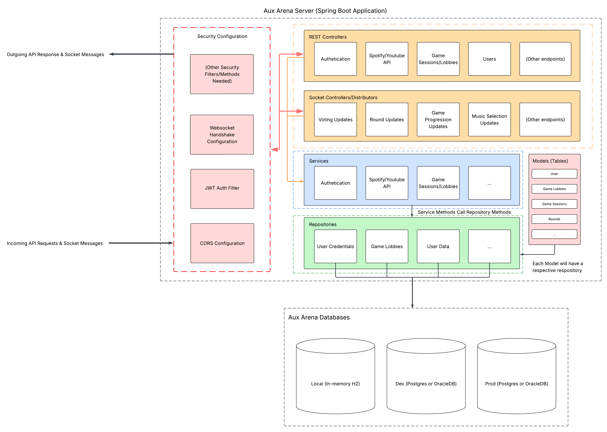
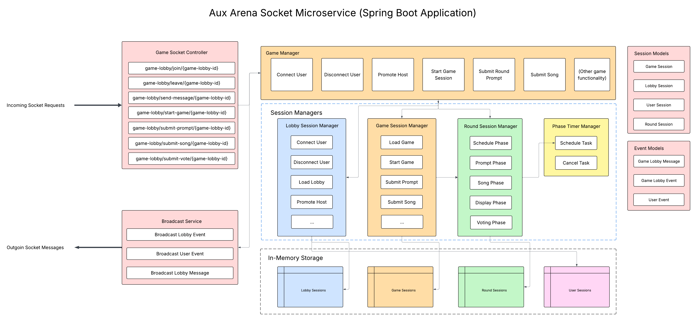

# Aux Arena — Backend Server

> **CISC498 Capstone Project** | Spring Boot REST + WebSocket Server for the Aux Arena Application

Aux Arena is a music-based multiplayer game platform. This repository contains the backend server built with **Java 17** and **Spring Boot 3**, responsible for user authentication, game lobby management, real-time communication via WebSockets, and persistence via PostgreSQL.

---

## Table of Contents

1. [Architecture Overview](#architecture-overview)
2. [Tech Stack](#tech-stack)
3. [Project Structure](#project-structure)
4. [Prerequisites](#prerequisites)
5. [Environment Variable Documentation](#environment-variable-documentation)
6. [Setup and Installation](#setup-and-installation)
7. [Running the Project Locally](#running-the-project-locally)
8. [API Documentation](#api-documentation)
9. [Deployment Instructions](#deployment-instructions)
10. [Known Bugs, Limitations, and Incomplete Features](#known-bugs-limitations-and-incomplete-features)
11. [Future Work Recommendations](#future-work-recommendations)
12. [Developer Notes](#developer-notes)

---

## Architecture Overview


The server follows a standard **layered architecture**:

- **Controller layer** — handles HTTP and WebSocket requests, delegates to services
- **Service layer** — contains all business logic
- **Repository layer** — Spring Data JPA interfaces for database access
- **Security layer** — Spring Security filter chain with stateless JWT authentication

---

### Server architecture



### Socket architecture




## Tech Stack

| Technology | Version | Purpose |
|---|---|---|
| Java | 17 | Primary language |
| Spring Boot | 3.5.5 | Application framework |
| Spring Security | (managed by Boot) | Authentication & authorization |
| Spring Data JPA | (managed by Boot) | ORM / database access |
| Spring WebSocket | (managed by Boot) | Real-time communication |
| Spring Actuator | (managed by Boot) | Health checks & metrics |
| PostgreSQL | Latest | Production database |
| H2 | Runtime | In-memory database for dev/testing |
| JJWT | 0.11.5 | JSON Web Token generation & validation |
| Lombok | 1.18.32 | Boilerplate reduction (getters, setters, builders) |
| SpringDoc OpenAPI | 2.5.0 | Swagger UI / API documentation |
| Maven | (wrapper included) | Build tool |

---

## Project Structure

```
CISC498-Project-Server/
├── .mvn/wrapper/               # Maven wrapper files (no local Maven install needed)
├── src/
│   ├── main/
│   │   ├── java/com/auxarena/ # Main application source code
│   │   │   ├── AuxArenaApplication.java   # Spring Boot entry point
│   │   │   ├── config/        # Security, WebSocket, and app configuration
│   │   │   ├── controller/    # REST and WebSocket controllers
│   │   │   ├── model/         # JPA entity classes (User, Lobby, etc.)
│   │   │   ├── repository/    # Spring Data JPA repository interfaces
│   │   │   ├── service/       # Business logic services
│   │   │   └── security/      # JWT utilities, filters, user details
│   │   └── resources/
│   │       ├── application.properties         # Base configuration
│   │       ├── application-dev.properties     # Dev-profile overrides (H2)
│   │       └── application-prod.properties    # Prod-profile overrides (PostgreSQL)
│   └── test/                  # Unit and integration tests
├── .gitignore
├── .gitattributes
├── mvnw                        # Maven wrapper script (Unix)
├── mvnw.cmd                    # Maven wrapper script (Windows)
└── pom.xml                     # Project dependencies and build configuration
```

### Key Files and Modules

| File / Folder | Description |
|---|---|
| `AuxArenaApplication.java` | Main entry point; starts the embedded Tomcat server |
| `config/` | Spring Security filter chain, CORS settings, WebSocket broker configuration |
| `controller/` | Exposes REST endpoints (auth, users, lobby) and WebSocket message handlers |
| `model/` | JPA entities that map to database tables (e.g., `User`, `Lobby`) |
| `repository/` | Interfaces extending `JpaRepository` for CRUD database operations |
| `service/` | Core business logic — authentication flows, lobby creation, game state |
| `security/` | JWT token generation, validation, and the request filter that authenticates each call |
| `pom.xml` | Declares all dependencies and Maven build plugins |

---

## Prerequisites

Before setting up the project, ensure you have the following installed:

- **Java 17** (JDK) — [Adoptium / Temurin recommended](https://adoptium.net/)
- **Maven** — not required if you use the included `./mvnw` wrapper
- **PostgreSQL** — required for production; not required for local dev (H2 is used instead)
- **Git**

Verify your Java version:

```bash
java -version
# Should output: openjdk version "17.x.x" ...
```

---

## Environment Variable Documentation

> **Never commit real secret values.** Copy the table below into a `.env` file or set these in your environment / deployment platform.

| Variable | Description | Example / Default |
|---|---|---|
| `SPRING_PROFILES_ACTIVE` | Active Spring profile (`dev` or `prod`) | `dev` |
| `DB_URL` | JDBC URL for the PostgreSQL database | `jdbc:postgresql://localhost:5432/auxarena` |
| `DB_USERNAME` | PostgreSQL username | `auxarena_user` |
| `DB_PASSWORD` | PostgreSQL password | *(secret — do not commit)* |
| `JWT_SECRET` | Base64-encoded HMAC secret for signing JWT tokens | *(secret — min 256-bit key)* |
| `JWT_EXPIRATION_MS` | JWT token lifetime in milliseconds | `86400000` (24 hours) |
| `SERVER_PORT` | Port the application listens on | `8080` |
| `ALLOWED_ORIGINS` | Comma-separated list of CORS-allowed frontend origins | `http://localhost:3000` |

For local development these values are typically set in `src/main/resources/application-dev.properties` (which is git-ignored for secrets) or exported in your shell:

```bash
export SPRING_PROFILES_ACTIVE=dev
export JWT_SECRET=your_local_dev_secret_here
```

---

## Setup and Installation

### 1. Clone the repository

```bash
git clone https://github.com/JamiePacheco/CISC498-Project-Server.git
cd CISC498-Project-Server
```

### 2. Configure environment

Create a local properties override file (already git-ignored):

```bash
# src/main/resources/application-dev.properties
spring.datasource.url=jdbc:h2:mem:auxarena
spring.datasource.driver-class-name=org.h2.Driver
spring.jpa.hibernate.ddl-auto=create-drop

jwt.secret=your_local_dev_secret_replace_me
jwt.expiration.ms=86400000
```

For a production-like local setup pointing to PostgreSQL:

```bash
# src/main/resources/application-prod.properties
spring.datasource.url=${DB_URL}
spring.datasource.username=${DB_USERNAME}
spring.datasource.password=${DB_PASSWORD}
spring.jpa.hibernate.ddl-auto=validate

jwt.secret=${JWT_SECRET}
jwt.expiration.ms=${JWT_EXPIRATION_MS:86400000}
```

### 3. Build the project

```bash
# Unix / macOS
./mvnw clean install

# Windows
mvnw.cmd clean install
```

This compiles the source, runs tests, and packages the application into a `.jar` under `target/`.

---

## Running the Project Locally

### Development mode (H2 in-memory database)

```bash
./mvnw spring-boot:run -Dspring-boot.run.profiles=dev
```

The server starts on `http://localhost:8080` by default.

The H2 console (useful for inspecting data during development) is available at:

```
http://localhost:8080/h2-console
JDBC URL: jdbc:h2:mem:auxarena
```

### With PostgreSQL locally

1. Ensure PostgreSQL is running and the `auxarena` database exists:

```sql
CREATE DATABASE auxarena;
CREATE USER auxarena_user WITH PASSWORD 'your_password';
GRANT ALL PRIVILEGES ON DATABASE auxarena TO auxarena_user;
```

2. Export the environment variables and run:

```bash
export SPRING_PROFILES_ACTIVE=prod
export DB_URL=jdbc:postgresql://localhost:5432/auxarena
export DB_USERNAME=auxarena_user
export DB_PASSWORD=your_password
export JWT_SECRET=your_jwt_secret

./mvnw spring-boot:run
```

### Running tests

```bash
./mvnw test
```

---

## API Documentation

This project uses **SpringDoc OpenAPI** to auto-generate interactive API documentation.

Once the server is running, open:

```
http://localhost:8080/swagger-ui/index.html
```

This provides a full list of all REST endpoints, request/response schemas, and the ability to make test calls directly from the browser.

### Core Endpoint Groups (expected)

| Group | Base Path | Description |
|---|---|---|
| Authentication | `/api/auth/**` | Register, login, token refresh |
| Users | `/api/users/**` | User profile management |
| Lobby | `/api/lobby/**` | Create, join, and manage game lobbies |
| WebSocket | `/ws` | Real-time game and lobby events |
| Actuator | `/actuator/**` | Health checks and server metrics |

> **Note:** Exact endpoint paths should be verified against the Swagger UI once the server is running, as they may evolve.

---

## Known Bugs, Limitations, and Incomplete Features

The following open issues have been tracked in the repository:

| Issue | Status | Description |
|---|---|---|
| #5 — WebSocket implementation | **Open** | WebSocket endpoint needs to be created and tested end-to-end |
| #4 — Game Lobby Functionality | **Open** | Full lobby creation, joining, and management flow is not yet implemented |
| #3 — Spring Profiles Configuration | **Open** | Dev vs. prod profiles need to be properly separated and validated |
| #2 — Base User Authentication | **Open** | Core JWT-based registration/login flow is in progress |

Additional known limitations:

- **No CI/CD pipeline** — there are no GitHub Actions workflows configured for automated build, test, or deployment.
- **No Dockerfile** — containerization support has not been added yet.
- **H2 schema not persisted** — the dev profile uses an in-memory H2 database that resets on every restart.
- **CORS configuration** — allowed origins may need to be tightened before production deployment.
- **No rate limiting** — the API has no rate limiting or throttling configured.

---

## Future Work Recommendations

The following enhancements are recommended for future development cycles:

1. **Complete WebSocket integration** — Implement and test the STOMP-based WebSocket broker for real-time lobby and game events (Issue #5).
2. **Finalize Game Lobby API** — Build out the full lobby lifecycle: creation, invitation, player readiness, and game start (Issue #4).
3. **Spring Profile hardening** — Separate all environment-sensitive configuration cleanly between `dev`, `test`, and `prod` profiles (Issue #3).
4. **Add CI/CD with GitHub Actions** — Automate build, test, and deployment on push to `main`.
5. **Dockerize the application** — Add a `Dockerfile` and optionally a `docker-compose.yml` for local full-stack development.
6. **Add integration tests** — Write `@SpringBootTest` integration tests covering the auth flow, lobby endpoints, and WebSocket connections.
7. **Implement refresh tokens** — The current JWT strategy likely uses only access tokens; adding refresh tokens improves security and UX.
8. **Add pagination** — Any list endpoints (lobbies, users) should support pagination to handle scale.
9. **Monitoring and observability** — Expand the Spring Actuator configuration and integrate with a monitoring service (e.g., Prometheus + Grafana).
10. **Database migrations** — Replace `ddl-auto=create-drop` / `validate` with a proper migration tool such as **Flyway** or **Liquibase** for safe schema evolution.

---

## Developer Notes

### Lombok

This project uses Lombok to reduce boilerplate. Ensure your IDE has the Lombok plugin installed:

- **IntelliJ IDEA**: Settings → Plugins → search "Lombok" → Install
- **VS Code**: Install the "Lombok Annotations Support" extension

### Code Style Conventions

- Class names: `PascalCase`
- Methods and variables: `camelCase`
- Constants: `UPPER_SNAKE_CASE`
- REST controllers annotated with `@RestController` and `@RequestMapping`
- Services annotated with `@Service`
- Repositories annotated with `@Repository` (or inferred by extending `JpaRepository`)

### Security Notes

- All endpoints except `/api/auth/**` require a valid `Authorization: Bearer <token>` header.
- JWTs are signed using HMAC-SHA256. The secret must be at least 256 bits (32 bytes).
- Passwords are stored using BCrypt hashing — **never store plain-text passwords**.

### Useful Actuator Endpoints

| Endpoint | Description |
|---|---|
| `GET /actuator/health` | Application health status |
| `GET /actuator/info` | App metadata |
| `GET /actuator/metrics` | JVM and application metrics |

---

Last updated: May 15th 2026.